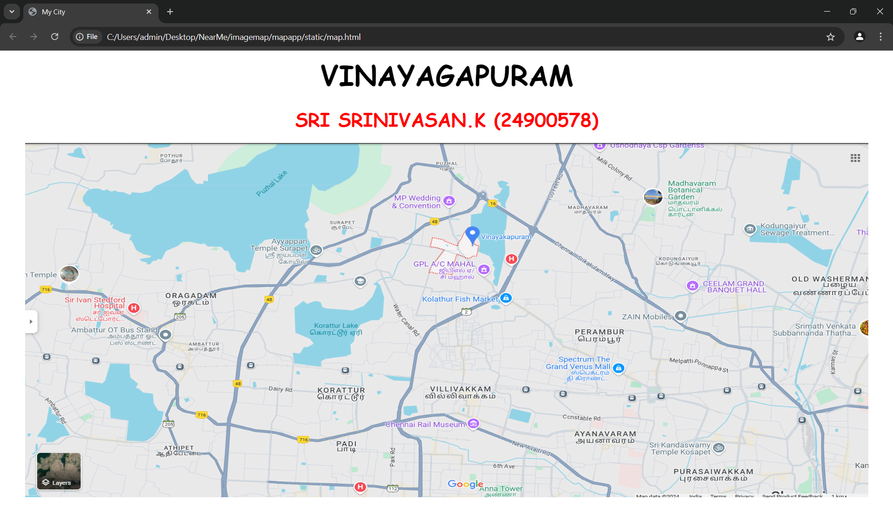
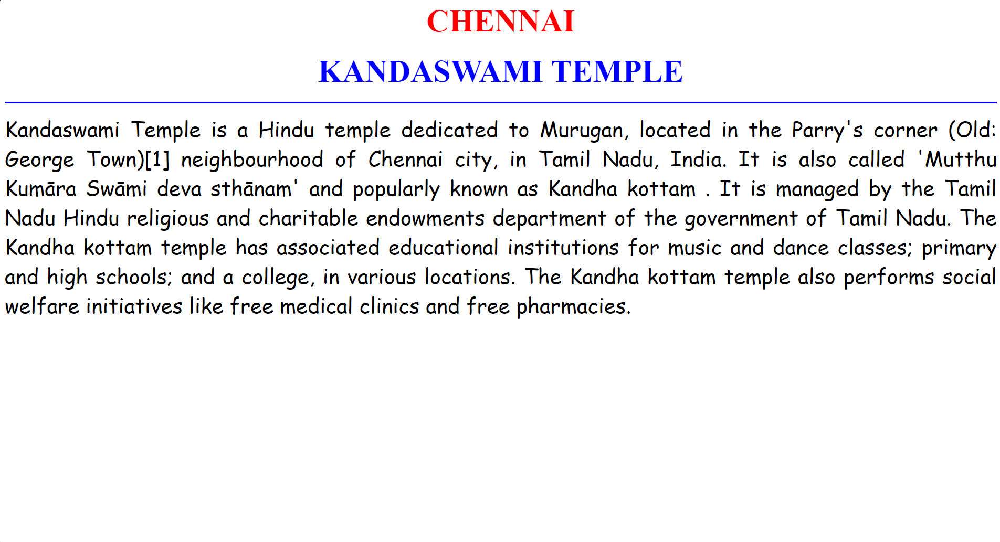
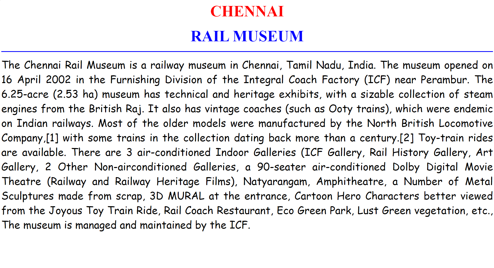
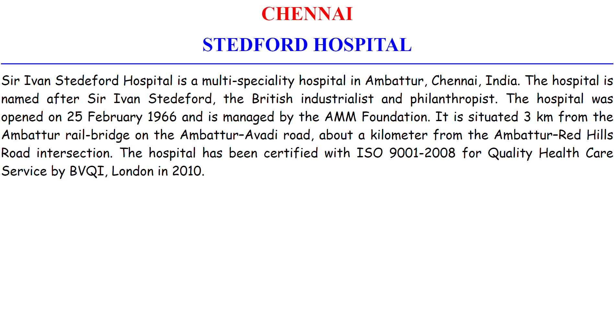
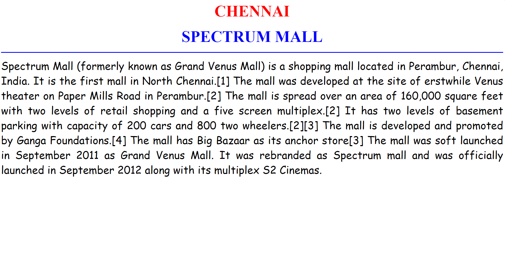
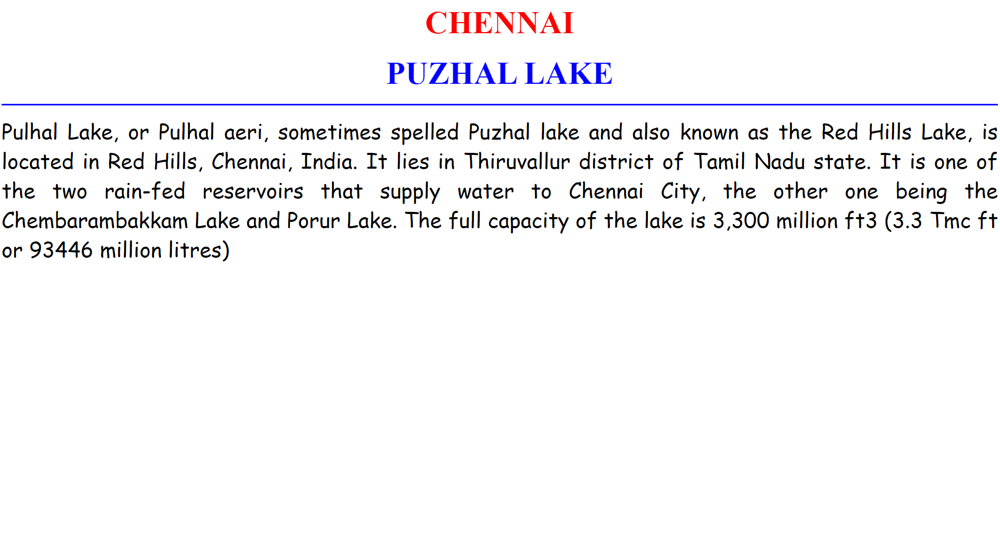

# Ex04 Places Around Me
## Date: 09-12-2024

## AIM
To develop a website to display details about the places around my house.

## DESIGN STEPS

### STEP 1
Create a Django admin interface.

### STEP 2
Download your city map from Google.

### STEP 3
Using ```<map>``` tag name the map.

### STEP 4
Create clickable regions in the image using ```<area>``` tag.

### STEP 5
Write HTML programs for all the regions identified.

### STEP 6
Execute the programs and publish them.

## CODE
```
map.html


<html>
<head>
<title>My City</title>
</head>
<body >
<h1 align="center">
<font color="black" size="10" face="cursive"><b>VINAYAGAPURAM</b></font>
</h1>
<h3 align="center">
<font color="Red" size="6" face="cursive"><b>SRI SRINIVASAN.K (24900578)</b></font>
</h3>
<center>

<map name="MyCity">
    <area target="" alt="Kandaswamy temple" title="Kandaswamy temple" href="temple.html" coords="1200,550,1100,500" shape="rect">
    <area target="" alt="rail museum" title="Rail Museum" href="museum.html" coords="700,450,800,500" shape="rect">
    <area target="" alt="stedford hospital" title="Stedford Hospital" href="hospital.html" coords="100,250,200,300" shape="rect">
    <area target="" alt="spectrum mall" title="Spectrum mall" href="spectrum.html" coords="1050,400,950,350" shape="rect">
    <area target="" alt="puzhal lake" title="Puzhal Lake" href="lake.html" coords="200,130,430,80" shape="rect">
  
</map>
</center>
</body>
</html>


temple.html

<html>
<head>
<title>MY HOME TOWN</title>
</head>
<body bgcolor="white">
<h1 align="center">
<font color="RED" size="10"><b>CHENNAI</b></font>    
</h1>
<h3 align="center">
<font color="blue" size="10"><b> KANDASWAMI TEMPLE </b></font>    
</h3>
<hr size="3" color="blue">
<p align="justify">
<font face="cursive" size="6">
    Kandaswami Temple  is a Hindu temple dedicated to Murugan, located in the Parry's corner (Old: George Town)[1] neighbourhood of Chennai city, in Tamil Nadu, India. It is also called 'Mutthu Kumāra Swāmi deva sthānam'  and popularly known as Kandha kottam . It is managed by the Tamil Nadu Hindu religious and charitable endowments department of the government of Tamil Nadu. The Kandha kottam temple has associated educational institutions for music and dance classes; primary and high schools; and a college, in various locations. The Kandha kottam temple also performs social welfare initiatives like free medical clinics  and free pharmacies.
    
 </font>
 </p>      
</body>
</html>


museum.html

<html>
<head>
<title>MY HOME TOWN</title>
</head>
<body bgcolor="white">
<h1 align="center">
<font color="RED" size="10"><b>CHENNAI</b></font>    
</h1>
<h3 align="center">
<font color="blue" size="10"><b>RAIL MUSEUM </b></font>    
</h3>
<hr size="3" color="blue">
<p align="justify">
<font face="cursive" size="6">
    The Chennai Rail Museum is a railway museum in Chennai, Tamil Nadu, India. The museum opened on 16 April 2002 in the Furnishing Division of the Integral Coach Factory (ICF) near Perambur. The 6.25-acre (2.53 ha) museum has technical and heritage exhibits, with a sizable collection of steam engines from the British Raj. It also has vintage coaches (such as Ooty trains), which were endemic on Indian railways. Most of the older models were manufactured by the North British Locomotive Company,[1] with some trains in the collection dating back more than a century.[2] Toy-train rides are available. There are 3 air-conditioned Indoor Galleries (ICF Gallery, Rail History Gallery, Art Gallery, 2 Other Non-airconditioned Galleries, a 90-seater air-conditioned Dolby Digital Movie Theatre (Railway and Railway Heritage Films), Natyarangam, Amphitheatre, a Number of Metal Sculptures made from scrap, 3D MURAL at the entrance, Cartoon Hero Characters better viewed from the Joyous Toy Train Ride, Rail Coach Restaurant, Eco Green Park, Lust Green vegetation, etc., The museum is managed and maintained by the ICF.
 </font>
 </p>      
</body>
</html>


hospital.html

<html>
<head>
<title>MY HOME TOWN</title>
</head>
<body bgcolor="white">
<h1 align="center">
<font color="RED" size="10"><b>CHENNAI</b></font>    
</h1>
<h3 align="center">
<font color="blue" size="10"><b>STEDFORD HOSPITAL </b></font>    
</h3>
<hr size="3" color="blue">
<p align="justify">
<font face="cursive" size="6">
    Sir Ivan Stedeford Hospital is a multi-speciality hospital in Ambattur, Chennai, India. The hospital is named after Sir Ivan Stedeford, the British industrialist and philanthropist. The hospital was opened on 25 February 1966 and is managed by the AMM Foundation. It is situated 3 km from the Ambattur rail-bridge on the Ambattur–Avadi road, about a kilometer from the Ambattur–Red Hills Road intersection. The hospital has been certified with ISO 9001-2008 for Quality Health Care Service by BVQI, London in 2010.
    
</font>
</p>      
</body>
</html>


spectrum.html

<html>
<head>
<title>MY HOME TOWN</title>
</head>
<body bgcolor="white">
<h1 align="center">
<font color="RED" size="10"><b>CHENNAI</b></font>    
</h1>
<h3 align="center">
<font color="blue" size="10"><b> SPECTRUM MALL  </b></font>    
</h3>
<hr size="3" color="blue">
<p align="justify">
<font face="cursive" size="6">
    Spectrum Mall (formerly known as Grand Venus Mall) is a shopping mall located in Perambur, Chennai, India. It is the first mall in North Chennai.[1] The mall was developed at the site of erstwhile Venus theater on Paper Mills Road in Perambur.[2] The mall is spread over an area of 160,000 square feet with two levels of retail shopping and a five screen multiplex.[2] It has two levels of basement parking with capacity of 200 cars and 800 two wheelers.[2][3] The mall is developed and promoted by Ganga Foundations.[4] The mall has Big Bazaar as its anchor store[3] The mall was soft launched in September 2011 as Grand Venus Mall. It was rebranded as Spectrum mall and was officially launched in September 2012 along with its multiplex S2 Cinemas.

</font>
</p>      
</body>
</html>


lake.html

<html>
<head>
<title>MY HOME TOWN</title>
</head>
<body bgcolor="white">
<h1 align="center">
<font color="RED" size="10"><b>CHENNAI</b></font>    
</h1>
<h3 align="center">
<font color="blue" size="10"><b>PUZHAL LAKE  </b></font>    
</h3>
<hr size="3" color="blue">
<p align="justify">
<font face="cursive" size="6">
    Pulhal Lake, or Pulhal aeri, sometimes spelled Puzhal lake and also known as the Red Hills Lake, is located in Red Hills, Chennai, India. It lies in Thiruvallur district of Tamil Nadu state. It is one of the two rain-fed reservoirs that supply water to Chennai City, the other one being the Chembarambakkam Lake and Porur Lake.

The full capacity of the lake is 3,300 million ft3 (3.3 Tmc ft or 93446 million litres)
    
</font>
</p>      
</body>
</html>


```

## OUTPUT :













## RESULT
The program for implementing image maps using HTML is executed successfully.
